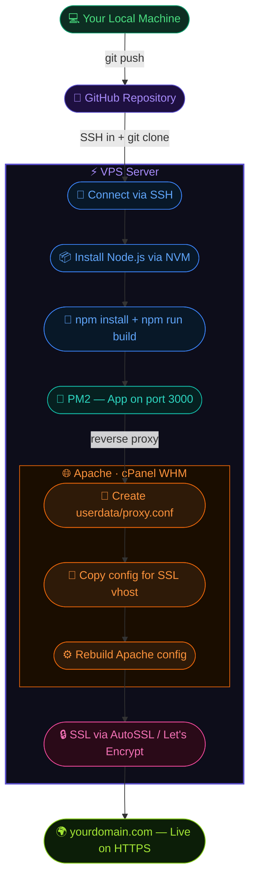

<div align="center">


<br/>

[](https://github.com/nowshad7/nextjs-vps-deployment-guide)
[](https://github.com/nowshad7/nextjs-vps-deployment-guide/fork)
[](LICENSE)
[](https://github.com/nowshad7/nextjs-vps-deployment-guide)
[](https://github.com/nowshad7/nextjs-vps-deployment-guide)

<br/>

> *You've built a Next.js app. Now what? Getting it live on a real server trips up a lot of developers.*
> *This guide walks you through the whole thing — from SSH to a working HTTPS domain — in under 30 minutes.*

</div>

---

## Deployment Pipeline



---

## Table of Contents

- [What You Need](#what-you-need)
- [Step 1 — SSH into your server](#step-1--ssh-into-your-server)
- [Step 2 — Install Node.js with NVM](#step-2--install-nodejs-with-nvm)
- [Step 3 — Clone, build, and start with PM2](#step-3--clone-build-and-start-with-pm2)
- [Step 4 — Configure Apache as a reverse proxy](#step-4--configure-apache-as-a-reverse-proxy)
- [Step 5 — Enable SSL](#step-5--enable-ssl)
- [Deploying Updates](#deploying-updates)
- [One-Command Deploy Script](#one-command-deploy-script)
- [PM2 Cheatsheet](#pm2-cheatsheet)
- [Apache Cheatsheet](#apache-cheatsheet)
- [Troubleshooting](#troubleshooting)
- [Security Checklist](#security-checklist)

---

## What You Need

| Requirement | Details |
|---|---|
| **Linux VPS** | AlmaLinux 8, Ubuntu, or Debian |
| **Domain** | Pointed at your server's IP |
| **cPanel / WHM** | For Apache config and SSL |
| **GitHub repo** | Your Next.js app pushed and ready |

---

## Step 1 — SSH into your server

Open Terminal (Mac/Linux) or PowerShell (Windows):

```bash
ssh your_username@your_server_ip
```

You're in when you see: `[john@server ~]$`

> **cPanel users:** Browser terminal is also available at `https://YOUR_IP:2083` → **Advanced → Terminal**

---

## Step 2 — Install Node.js with NVM

NVM is the cleanest way to manage Node on a server — no `sudo` headaches.

```bash
curl -o- https://raw.githubusercontent.com/nvm-sh/nvm/v0.39.7/install.sh | bash
source ~/.bashrc
nvm install --lts
nvm use --lts

node -v   # v20.x.x
npm -v    # 10.x.x
```

---

## Step 3 — Clone, build, and start with PM2

```bash
git clone https://github.com/YOU/YOUR_REPO.git
cd YOUR_REPO

nano .env.local        # add your env vars here

npm install
npm run build

npm install -g pm2
pm2 start npm --name "my-app" -- start
pm2 save && pm2 startup
```

> [!WARNING]
> After `pm2 startup`, copy and run the full `sudo env PATH=...` command it prints.
> Without it, your app **won't survive a server reboot**.

Test it's working before touching Apache:

```bash
curl http://localhost:3000
```

App is live when you see:

```
┌────┬───────────┬───────┬────────┬─────┬──────────┐
│ id │ name      │ mode  │ status │ cpu │ memory   │
├────┼───────────┼───────┼────────┼─────┼──────────┤
│ 0  │ my-app    │ fork  │ online │ 0%  │ 30.0mb   │
└────┴───────────┴───────┴────────┴─────┴──────────┘
```

---

## Step 4 — Configure Apache as a reverse proxy

This is where most tutorials go wrong. On cPanel/WHM servers, **never edit vhost files directly** — they get overwritten on every rebuild. Instead, use the `userdata` directory.

> [!NOTE]
> Replace `cpanelusername` and `yourdomain.com` with your actual cPanel username and domain throughout all commands below.

### 1 — Create the config directories

```bash
mkdir -p /etc/apache2/conf.d/userdata/std/2_4/cpanelusername/yourdomain.com
mkdir -p /etc/apache2/conf.d/userdata/ssl/2_4/cpanelusername/yourdomain.com
```

### 2 — Create the proxy config

```bash
nano /etc/apache2/conf.d/userdata/std/2_4/cpanelusername/yourdomain.com/proxy.conf
```

Paste this inside:

```apache
<IfModule mod_proxy.c>
    ProxyPreserveHost On
    ProxyPass / http://127.0.0.1:3000/
    ProxyPassReverse / http://127.0.0.1:3000/
</IfModule>
```

Save: **Ctrl + X → Y → Enter**

### 3 — Copy the config for SSL

```bash
cp /etc/apache2/conf.d/userdata/std/2_4/cpanelusername/yourdomain.com/proxy.conf \
   /etc/apache2/conf.d/userdata/ssl/2_4/cpanelusername/yourdomain.com/
```

### 4 — Rebuild Apache

```bash
/scripts/ensure_vhost_includes --all-users
/scripts/rebuildhttpdconf
/scripts/restartsrv_httpd
```

> [!TIP]
> Files in `userdata/` survive cPanel/WHM updates and Apache rebuilds.
> Editing vhosts directly gets overwritten — this is the correct, production-safe method.

---

## Step 5 — Enable SSL

In cPanel go to **Security → SSL/TLS Status** → click **Run AutoSSL**.

A free Let's Encrypt certificate applies within 1–2 minutes. Done.

Alternatively via SSH (Certbot):

```bash
sudo dnf install certbot python3-certbot-nginx -y
sudo certbot --nginx -d yourdomain.com -d www.yourdomain.com
sudo certbot renew --dry-run
```

---

## Deploying Updates

Every time you push new code, SSH in and run:

```bash
cd ~/YOUR_REPO
git pull
npm install
npm run build
pm2 restart my-app
```

---

## One-Command Deploy Script

Save this as `deploy.sh` in your project root:

```bash
#!/bin/bash
set -e

echo "Pulling latest changes..."
git pull

echo "Installing dependencies..."
npm install

echo "Building..."
npm run build

echo "Restarting app..."
pm2 restart my-app

echo "Done! App is live."
```

Make it executable and run it:

```bash
chmod +x deploy.sh
./deploy.sh
```

---

## PM2 Cheatsheet

| Command | What it does |
|---|---|
| `pm2 list` | Show all running apps |
| `pm2 logs my-app` | View live logs (Ctrl+C to exit) |
| `pm2 restart my-app` | Restart the app |
| `pm2 reload my-app` | Zero-downtime restart |
| `pm2 stop my-app` | Stop the app |
| `pm2 delete my-app` | Remove from PM2 |
| `pm2 monit` | Real-time CPU/memory dashboard |
| `pm2 show my-app` | Detailed app info |
| `pm2 save` | Save process list |
| `pm2 startup` | Enable auto-start on reboot |

---

## Apache Cheatsheet

| Command | What it does |
|---|---|
| `/scripts/restartsrv_httpd` | Restart Apache (WHM way) |
| `/scripts/rebuildhttpdconf` | Rebuild Apache config from WHM settings |
| `/scripts/ensure_vhost_includes --all-users` | Apply userdata config for all accounts |
| `httpd -t` | Test Apache config for syntax errors |
| `apachectl graceful` | Reload without dropping connections |
| `systemctl status httpd` | Check if Apache is running |
| `tail -f /usr/local/apache/logs/error_log` | Watch Apache error log live |

> On cPanel servers always use `/scripts/` commands — don't use `systemctl restart httpd` as it bypasses WHM's process watcher.

---

## Troubleshooting

| Problem | Fix |
|---|---|
| `nvm: command not found` | Run `source ~/.bashrc` then retry |
| `npm run build` fails | Check all `.env` variables are set |
| 502 Bad Gateway | App crashed — check `pm2 logs my-app` |
| Port 3000 already in use | `kill $(lsof -t -i:3000)` then restart PM2 |
| Proxy not working after rebuild | Re-run `/scripts/ensure_vhost_includes --all-users` |
| SSL not working | Check domain DNS points to your server IP |
| Git pull asks for password | Use a Personal Access Token, not your GitHub password |

Quick diagnostics:

```bash
pm2 logs my-app                            # app errors
pm2 list                                   # is the app running?
curl http://localhost:3000                 # does the app respond?
lsof -i :3000                             # who is on port 3000?
tail -f /usr/local/apache/logs/error_log  # apache errors
df -h && free -h                          # disk + memory
```

---

## Security Checklist

- [ ] Change default SSH password after first login
- [ ] Set up SSH key-based authentication
- [ ] Disable password SSH login after keys are working
- [ ] Never commit `.env` files to Git — add `.env*` to `.gitignore`
- [ ] Keep Node.js, npm, and PM2 updated
- [ ] Enable firewall: `ufw allow 80 && ufw allow 443 && ufw allow 22`

---

<div align="center">

**`nextjs`** &nbsp;·&nbsp; **`nodejs`** &nbsp;·&nbsp; **`vps`** &nbsp;·&nbsp; **`apache`** &nbsp;·&nbsp; **`cpanel`** &nbsp;·&nbsp; **`pm2`** &nbsp;·&nbsp; **`deployment`** &nbsp;·&nbsp; **`devops`**


*Made for junior developers. If this helped you, consider giving it a ⭐ — it helps others find it too.*

</div>
